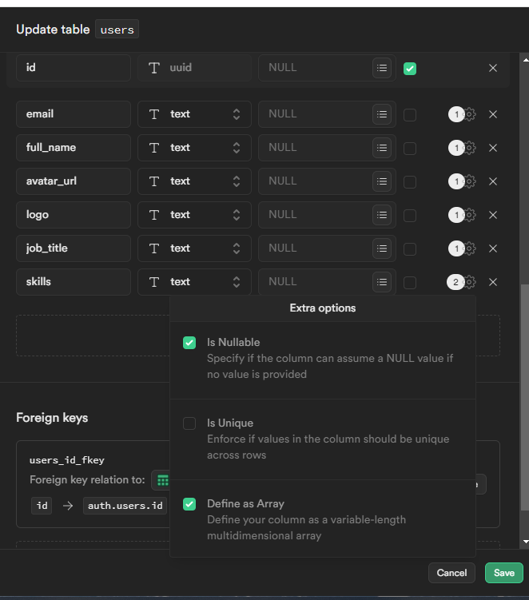

## Learning how to use Supabase with NextJS


First, do the following:

```js
- add authentication providers in supabase dashboard.
- in case of OAuth providers, add client and secret keys in supabase dashboard.
- add site URL to localhost:3000 in URL configuration under Authentication in supabase dashboard. (make sure to change it after deploy)
- fill .env.local file
- configure lib/supabase/client
- configure lib/supabase/server
```

then , run the development server:

```bash
npm install
npm run dev
```

Open [http://localhost:3000](http://localhost:3000) with your browser to see the result.

#### Supabase Services Used

- Authentication (refresh auth token using middleware included)

#### Project Features

- The project UI is incomplete but it has fully functional functionalities.
- Password less authentication, A user can create an account using only the email, a confirmation email is sent to let user verify their email (using supabase server, server action)
- OAuth (Google and Github) authentication (using supabase client)
- Page protection example in Navbar (for protected pages)
- Signout user on Navbar (client)
- Middleware to check for cookies on every request, (this is to refresh expired Auth tokens and store them back to cookies and localstorage)
- Save the authenticated users to Supabase Database (queries & policies are in lib/supabase/queries.txt) (added more columns in supabase dashboard, image attached)
- Sync the supabase types to our project types (this will create types/, check resources)
- supabase storage to upload user profile pictures. (created it's policies on supabase dashboard, image attached)
- Fetch complete path of storage items using server actions (in profile/page)
- created a db function (queries & policies are in lib/supabase/queries.txt) & use it to update user skills using supabase RPC (in profile/page).

#### Authentication Strategies used

- PasswordLess Authentication, with Email only (Magic Link)
- OAuth (Google and Github)

#### Known issues of the project

- Signin with email will throw an error, this is because we have set a db function "handle_new_user" in supabase which will add the newly auth user details in users table. Since the user signed up with email doesn't have required info, the function fails (while authentication works as it should be). To fix this, redirect to a profile signup form after user verifies the email and then save the user details to the table.

#### Reference Images




#### Useful resources for Supabase with NextJS

- [Authentication with NextJS SSR](https://www.youtube.com/watch?v=VVElr2n90KY)
- [Supabase SSR package](https://supabase.com/docs/guides/auth/server-side/overview)
- [How to Increase Supabase signup rate limit 3000 free emails](https://medium.com/@techalchimiste/how-to-increase-supabase-signup-rate-limit-3000-emails-mo-261289882cf4)
- [Syncing supabase type to project types](https://supabase.com/docs/guides/api/rest/generating-types)

Made by [Noor Muhammad](https://www.linkedin.com/in/connectwithnoor)
